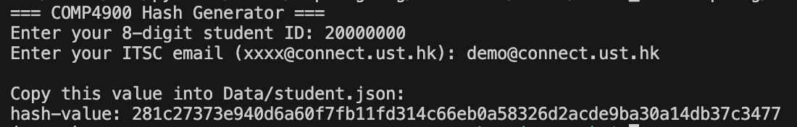

# HKUST 2026 Spring COMP 4900 GitHub Training Module Task

Welcome to the COMP 4900 GitHub Training Module task. You can review the training module material website [here](https://minglol7794.github.io/github_tutorial/COMP4900-Website)

## Task

In this exercise, you will practice a standard open-source contribution workflow:
1. Fork a repository
2. Clone your fork locally
3. Create a branch
4. Run a Python helper to hash your identity data
5. Edit your student record with hashed data
6. Push your branch
7. Open a pull request

For a detailed explanation of the training task, please refer to:
[COMP4900 GitHub Training Website](https://minglol7794.github.io/github_tutorial/COMP4900-Website/#task-instructions)

After your pull request is validated, you will submit the pull request link on Canvas.

## Before You Start

Please make sure you have:
1. A GitHub account
2. Git installed on your computer
3. Python 3.13.7 installed

Use Python 3.13.7 for this task.
Please follow this guide to download python if you forgot how to step up: 
https://course.cse.ust.hk/comp1023/python-vscode/

No extra Python package is required for `Data/generate_hash.py`.

## Step-by-Step Instructions

## Step 1: Fork This Repository

Click the **Fork** button on GitHub to create your own copy of this repository under your account.

## Step 2: Clone Your Fork

Clone your forked repository to your local machine:

```bash
git clone <your-fork-url>
cd COMP4900
```

Example fork URL:

```bash
https://github.com/<your-github-username>/pull-request-test.git
```

## Step 3: Create a New Branch

Create a new branch before making changes:

```bash
git checkout -b add-my-student-info
```

## Step 4: Run the Hash Generator

Run the Python helper script:

```bash
python3 Data/generate_hash.py
```

The script will ask for:
1. Student ID
2. ITSC email

The script outputs:
1. `hash-value`

We use a hash value for privacy protection. Your raw student ID and ITSC email are not stored in the repository; only the one-way hashed result is submitted.

Example:


## Step 5: Edit Data/student.json

Open `Data/student.json` and update your record with:
1. GitHub username
2. `hash-value` (from script output)
3. `name` (optional, you can leave it empty)

Using `hash-value` helps protect your personal data in a public version-control workflow.

Please keep the JSON format valid (do not break commas, brackets, or quotes).

Example:

```json
{
  "github-username": "hkust-git",
  "hash-value": "281c27373e940d6a60f7fb11fd314c66eb0a58326d2acde9ba30a14db37c3477",
}
```
(The hash value is same value you get from the program)

## Step 6: Commit and Push Your Changes

Stage, commit, and push your branch:

```bash
git add Data/student.json
git commit -m "Add my COMP4900 student information"
git push origin add-my-student-info
```

## Step 7: Open a Pull Request

On GitHub, open a pull request from your branch in your fork to the target branch of the original repository.

Make sure your pull request clearly shows your `Data/student.json` update.

## Step 8: Wait for Auto-Validation

If your submission is correct:
1. You will receive an automatic reply in the pull request

2. Your hashed record will be updated in the tracking spreadsheet

You can check whether your pull request is successfully recorded here:
[Pull Request Tracking Spreadsheet](https://docs.google.com/spreadsheets/d/1P81-TPUOiYIHPcdzJMZH5RLOhV9ChRGGtxq_yakSkxw/edit?gid=0#gid=0)

If validation fails, read the bot message, fix the issue, and push updates to the same branch.

## Step 9: Submit on Canvas

Submit your pull request link to Canvas:

[Canvas submission link](https://canvas.ust.hk/courses/67791/assignments/424723?module_item_id=1753451)

## Quick Checklist

Before submitting, confirm that:
1. You forked the repository
2. You created a separate branch
3. You created and activated a virtual environment (`.venv`)
4. You ran `python Data/generate_hash.py` locally
5. You only edited `Data/student.json` with hash output values
6. Your JSON format is valid
7. Your pull request is open and visible
8. You submitted the pull request link on Canvas

## Extra
Here is a Nessie, cute.

